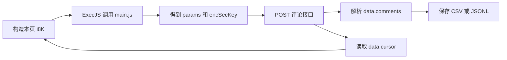

# 网易云音乐评论接口逆向模板

[](https://github.com/yuanqishaonvyufan/netease-cloudmusic-comments-reverse/actions/workflows/ci.yml)

一个面向学习与研究的 Python + JavaScript 网页接口逆向案例。它使用 `PyExecJS` 调用本地 `main.js` 完成网易云 `weapi` 的 AES + RSA 参数加密，再按网页的 `cursor` 逻辑顺序抓取歌曲评论，支持 CSV/JSONL 增量保存。

> 本项目不使用 Selenium、Playwright 等浏览器自动化工具。接口、参数和风控策略可能随网站更新而变化，请仅在遵守网站服务条款和当地法律的前提下，以合理频率用于学习、测试和个人研究。

## 功能

- 接受歌曲 ID 或完整歌曲链接
- 复用本地逆向后的 `main.js`，动态生成 `params`、`encSecKey`
- 根据上一页响应的 `cursor` 自动翻页
- Cookie 可选，自动从 Cookie 提取 `__csrf`
- 支持 CSV、JSONL 两种输出格式
- 网络超时重试、重复页检测、异常中断保留已抓数据
- 提供 `--dry-run` 加密自检、离线单元测试和 GitHub Actions CI
- 不把 Cookie、抓取结果、HAR 或大型网页源码提交到仓库

## 工作流程



## 环境要求

- Python 3.10+
- Node.js 18+
- Windows、macOS 或 Linux

确认环境：

```bash
python --version
node --version
```

## 快速开始

```bash
git clone https://github.com/yuanqishaonvyufan/netease-cloudmusic-comments-reverse.git
cd netease-cloudmusic-comments-reverse
python -m pip install -r requirements.txt
python netease_comments.py 204072
```

默认结果写入：

```text
output/comments_204072.csv
```

也可以直接传歌曲链接：

```bash
python netease_comments.py "https://music.163.com/song?id=204072"
```

先测试 JS 加密，不发送网络请求：

```bash
python netease_comments.py 204072 --dry-run
```

只抓两页，适合首次测试：

```bash
python netease_comments.py 204072 --max-pages 2 --sleep 1.5
```

输出 JSONL：

```bash
python netease_comments.py 204072 --format jsonl
```

查看所有参数：

```bash
python netease_comments.py --help
```

## Cookie 与 csrf_token

公共评论通常可以先不填写 Cookie。如果接口返回登录、风控或空数据，再进行配置：

1. 浏览器登录网易云音乐并打开目标歌曲页。
2. 按 `F12`，进入“网络 / Network”面板并选择 `Fetch/XHR`。
3. 刷新页面，找到名称含 `comment/resource/comments/get` 的请求。
4. 在“请求标头 / Request Headers”中复制 `Cookie` 冒号后的完整内容。
5. 复制 `config.example.py` 为 `config.py`，把内容粘贴到 `COOKIE`。

```python
COOKIE = "这里粘贴浏览器 Cookie"
CSRF_TOKEN = ""  # 通常留空，程序会从 COOKIE 的 __csrf 自动提取
```

也可以临时使用环境变量：

```powershell
$env:NETEASE_COOKIE = "浏览器 Cookie"
$env:NETEASE_CSRF_TOKEN = "可选"
python .\netease_comments.py 204072
```

`config.py`、`.env` 和抓取结果已经被 `.gitignore` 排除。不要在截图、Issue 或提交记录中公开 Cookie。

## 输出字段

| 字段 | 含义 |
|---|---|
| `comment_id` | 评论 ID |
| `user_id` | 用户 ID |
| `username` | 用户昵称 |
| `content` | 评论正文 |
| `liked_count` | 点赞数 |
| `reply_count` | 回复数 |
| `ip_location` | 接口返回的 IP 属地 |
| `timestamp` | 毫秒时间戳 |
| `publish_time` | 网页返回或本地转换的可读时间 |

## 项目结构

```text
.
├── netease_comments.py       # 主程序：参数、请求、翻页、解析、输出
├── main.js                   # 逆向加密：getData(i8K) -> 两个密文字段
├── config.example.py         # Cookie 配置示例
├── requirements.txt
├── docs/
│   └── reverse-engineering.md
├── tests/
│   └── test_logic.py
└── .github/workflows/ci.yml
```

本地抓包得到的大型页面脚本 `test.js` 不属于运行依赖，也不会上传；它只用于个人分析。模板实际运行只需要 `netease_comments.py` 和 `main.js`。

## 逆向关键点

网页不会把原始分页 JSON 直接发给服务端，而是发送表单：

```text
params=<两次 AES 加密后的正文>
encSecKey=<RSA 加密后的随机 AES 密钥>
```

第一页使用 `cursor=-1`，后续页必须把上一页响应中的 `data.cursor` 放入下一页 i8K，然后重新调用 `getData(i8K)`。如果只在加载 `main.js` 时加密一次，所有请求都会重复第一页。

完整抓包结构、参数含义与维护流程见 [逆向分析文档](docs/reverse-engineering.md)。

## 测试

离线测试不会访问网易云接口：

```bash
python -m unittest discover -s tests -v
node --check main.js
```

联网冒烟测试：

```bash
python netease_comments.py 204072 --max-pages 1 --sleep 0
```

## 常见问题

### `ModuleNotFoundError: No module named 'execjs'`

```bash
python -m pip install -r requirements.txt
```

### `Could not find an available JavaScript runtime`

安装 Node.js，重新打开终端，再运行 `node --version`。

### 第一页成功，第二页重复

检查是否把上一页的 `data.cursor` 写入下一页请求，并且每一页都重新调用 `getData(i8K)`。

### 接口返回空数据或风控

- 减慢 `--sleep`，保留默认随机间隔。
- 从浏览器重新复制 Cookie。
- 检查接口地址、请求字段和网页脚本是否已经更新。
- 不要高并发请求或长时间持续运行。

## 维护说明

这是网页逆向模板，不是稳定官方 SDK。网站更新后优先检查：

1. 评论 XHR 的 URL 是否变化。
2. 加密前 i8K 的字段是否变化。
3. `main.js` 中指数、模数、nonce、AES IV 是否变化。
4. 返回 JSON 中 `comments`、`cursor`、`totalCount` 的层级是否变化。

请不要仅凭某次断点出现的 `logs + csrf_token` 判断评论请求参数；页面会同时加密很多不同接口，必须先在 Network 中锁定评论请求，再回溯其调用栈。

## License

[MIT](LICENSE)
