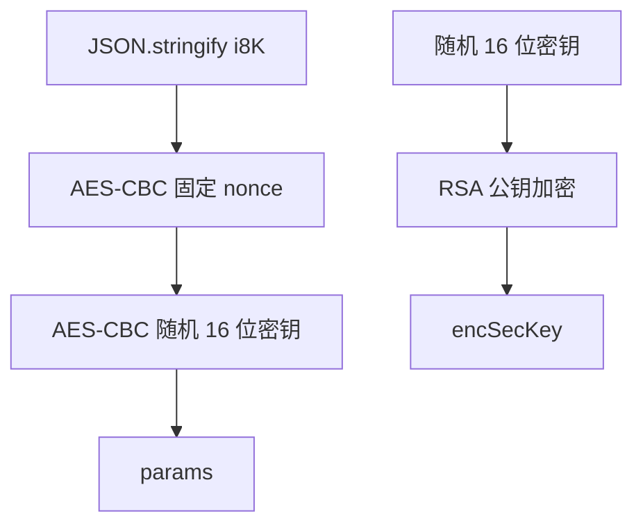

# 网易云评论接口逆向分析

本文记录的是教学模板的分析路径，重点是如何从开发者工具中的真实请求得到可维护代码，而不是死记某一组密文。网页资源和接口可能更新，具体字段应以你当时抓到的请求为准。

## 1. 定位目标请求

打开歌曲页后进入开发者工具：

1. 选择“网络 / Network”。
2. 选择 `Fetch/XHR`。
3. 清空现有记录，再刷新歌曲页。
4. 搜索 `comment`。
5. 定位 `POST /weapi/comment/resource/comments/get`。

重点查看四处：

- Request URL：接口地址。
- Request Headers：`Origin`、`Referer`、`User-Agent`、`Cookie`。
- Form Data：加密后的 `params`、`encSecKey`。
- Response：`data.comments`、`data.cursor`、`data.totalCount`。

如果断点停在只包含 `logs` 和 `csrf_token` 的对象上，通常说明截获了页面中的另一个埋点请求。一个页面会同时调用许多经过相同 `weapi` 加密层的接口，必须先锁定评论 XHR，再从 Initiator/调用栈回溯。

## 2. 加密前分页对象

评论请求的核心 i8K 结构如下：

```json
{
  "rid": "R_SO_4_204072",
  "threadId": "R_SO_4_204072",
  "pageNo": 1,
  "pageSize": 20,
  "cursor": -1,
  "offset": 0,
  "orderType": 1,
  "csrf_token": ""
}
```

| 参数 | 作用 |
|---|---|
| `rid` | 资源标识；歌曲格式为 `R_SO_4_<歌曲ID>` |
| `threadId` | 评论线程标识，歌曲评论通常与 `rid` 相同 |
| `pageNo` | 当前页码，从 1 开始 |
| `pageSize` | 每页数量，网页通常使用 20 |
| `cursor` | 翻页游标；第一页为 -1，后续使用上一页响应值 |
| `offset` | 顺序向后翻页时为 0 |
| `orderType` | 评论排序方式；当前网页顺序翻页使用 1 |
| `csrf_token` | 登录态 CSRF 值，通常来自 Cookie 的 `__csrf` |

## 3. asrsea 加密逻辑

网页的 `weapi` 请求大致执行以下过程：

1. 生成 16 位随机字符串，作为第二层 AES 密钥。
2. 用固定 nonce 对 `JSON.stringify(i8K)` 做第一次 AES-CBC 加密。
3. 用随机密钥对第一次密文做第二次 AES-CBC 加密，结果作为 `params`。
4. 使用 RSA 公钥加密随机 AES 密钥，结果作为 `encSecKey`。



因此每次加密得到的密文可以不同，这是随机密钥造成的正常现象。判断逆向是否成功，不应比较密文是否与浏览器逐字相同，而应检查服务端能否正常解密并返回 `code=200`。

## 4. 为什么 main.js 必须暴露动态函数

错误写法是在 JS 文件加载时就执行一次：

```javascript
var encrypted = asrsea(JSON.stringify(i8K), exponent, modulus, nonce)
function getData() {
  return encrypted
}
```

这种写法无论 Python 请求第几页，取到的都是第一次生成的密文。

模板使用：

```javascript
function getData(i8K) {
  var encrypted = window.asrsea(
    JSON.stringify(i8K),
    exponent,
    modulus,
    nonce
  )
  return {
    params: encrypted.encText,
    encSecKey: encrypted.encSecKey
  }
}
```

Python 每翻一页都会执行：

```python
encrypted = js_context.call("getData", page_data)
```

ExecJS 获取的是函数的 `return` 值，不是 `console.log()` 输出。因此供 Python 调用的 JS 函数必须明确返回对象。

## 5. POST 表单结构

加密后的请求不是 JSON Body，而是表单：

```python
form_data = {
    "params": encrypted["params"],
    "encSecKey": encrypted["encSecKey"],
}

response = session.post(
    "https://music.163.com/weapi/comment/resource/comments/get",
    params={"csrf_token": csrf_token},
    data=form_data,
)
```

`requests` 接收到 `data=dict` 后会使用 `application/x-www-form-urlencoded` 编码，这与浏览器抓包中的 Form Data 对应。

## 6. cursor 翻页

翻页核心不是简单计算 `offset = page * pageSize`，而是传递游标：

```text
第 1 页请求 cursor = -1
第 1 页响应 data.cursor = A
第 2 页请求 cursor = A
第 2 页响应 data.cursor = B
第 3 页请求 cursor = B
```

每次更新 cursor 后，整个 i8K 都要重新交给 `main.js` 加密。

接口的 `totalCount`、`hasMore` 可能因缓存或实时评论变化出现短暂不一致。模板综合使用以下条件停止：

- 本页为空。
- 本页数量小于 `pageSize`。
- 响应没有 cursor。
- cursor 重复。
- 一整页没有新增评论 ID。
- 达到用户指定的 `--max-pages`。

## 7. Cookie 的处理

Cookie 是 HTTP 请求头，不属于 `params` 或 `encSecKey`。`requests.Session` 会把你配置的 Cookie 放入每次请求的 `Cookie` 请求头。

模板的读取优先级：

1. 环境变量 `NETEASE_COOKIE`、`NETEASE_CSRF_TOKEN`。
2. 本地 `config.py`。
3. 空字符串。

如果没有单独设置 csrf_token，Python 会从 Cookie 的 `__csrf` 字段自动提取。任何时候都不要把真实 Cookie 写入 `config.example.py`、README、Issue 或 Git 提交历史。

## 8. 网站更新后的重新分析顺序

1. 在 Network 中确认目标评论请求是否还存在。
2. 使用“复制为 cURL”保存一份脱敏后的请求结构。
3. 查看 Initiator，定位构造 `pageNo/pageSize/cursor` 的网页代码。
4. 在 XHR/fetch 断点中只填写目标 URL 关键字，避免页面在无关埋点请求上暂停。
5. 对 `params` 生成位置设置断点，观察加密前对象。
6. 对比 `main.js` 的常量和调用参数是否变化。
7. 先运行 `--dry-run`，再运行 `--max-pages 1`，最后测试两页 cursor 是否不同。

## 9. 合理使用

- 使用低请求频率，不做高并发。
- 只抓取完成学习目标所需的数据量。
- 不公开 Cookie 或用户敏感信息。
- 不把抓取结果用于骚扰、画像或其他侵害用户权益的用途。
- 网站规则或当地法律不允许时，应停止使用。
